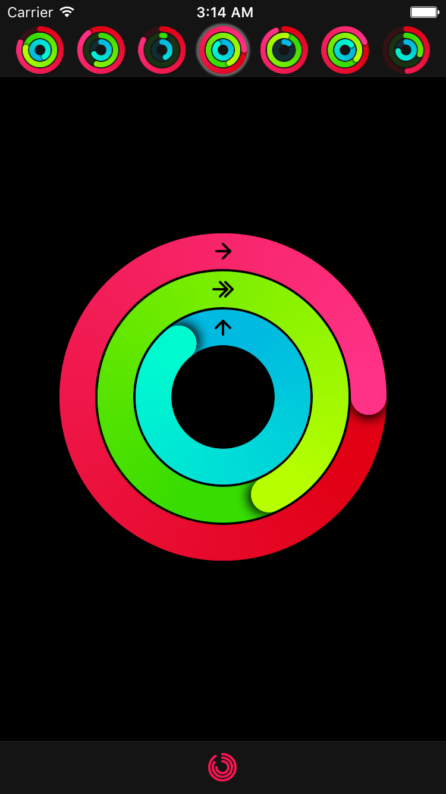

# MKRingProgressView

[](https://developer.apple.com/swift)
[](http://cocoapods.org/pods/MKRingProgressView)
[](http://cocoapods.org/pods/MKRingProgressView)
[](http://cocoapods.org/pods/MKRingProgressView)
[](https://github.com/Carthage/Carthage)


Ring progress view similar to Activity app on Apple Watch



## Features
- Progress animation
- Customizable start/end and backdrop ring colors
- Customizable ring width
- Customizable shadow under progress line end
- Progress values above 100% (or 360°) can also be displayed

## Installation
### CocoaPods

To install `MKRingProgressView` via [CocoaPods](http://cocoapods.org), add the following line to your Podfile:

```
pod 'MKRingProgressView'
```

### Carthage

To install `MKRingProgressView` via [Carthage](https://github.com/Carthage/Carthage#if-youre-building-for-ios-tvos-or-watchos), add the following line to your Cartfile:

```
github "maxkonovalov/MKRingProgressView"
```

### Manually
Just add `MKGradientGenerator.swift` and `MKRingProgressView.swift` to your Xcode project.

## Usage
See example Xcode project. It also contains additional classes for convenient grouping of 3 ring progress views replicating Activity app by Apple.

### Interface Builder
`MKRingProgressView` can be set up in Storyboard. Specify `startColor`, `endColor`, `ringWidth` and optional `backgroundRingColor` (if not set, defaults to `startColor` with 15% opacity).

### Code
```swift
let ringProgressView = MKRingProgressView(frame: CGRect(x: 0, y: 100, width: 100, height: 100))
ringProgressView.startColor = .red
ringProgressView.endColor = .magenta
ringProgressView.ringWidth = 25
ringProgressView.progress = 0.0
view.addSubview(ringProgressView)
```

To adjust `progress` animation duration, use `CATransaction`:

```swift
CATransaction.begin()
CATransaction.setAnimationDuration(1.0)
ringProgressView.progress = 1.0
CATransaction.commit()
```

## Dependencies
Conical gradient image for progress ring is drawn using [MKGradientGenerator](https://github.com/maxkonovalov/MKGradientView). It is already included in the code, so just add `MKGradientGenerator.swift` along with `MKRingProgressView.swift` file to your project.

## Requirements
- iOS 8.0
- Xcode 8, Swift 3

## License
`MKRingProgressView` is available under the MIT license. See the LICENSE file for more info.
